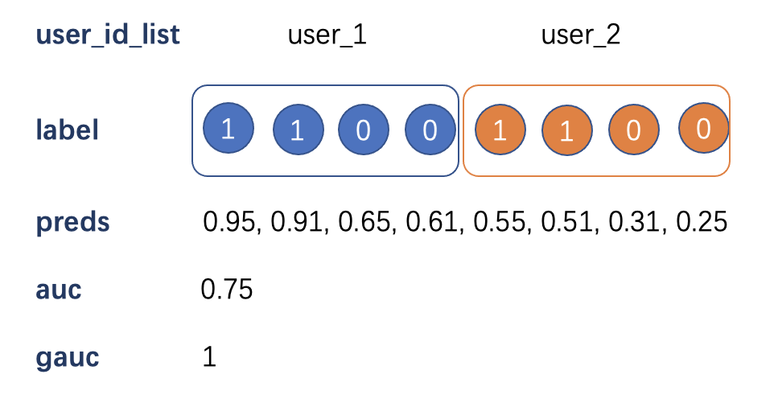

# 面试题目

- 基于python手写一下AUC，GAUC的代码
    
    auc的定义：ROC曲线下方的面积大小，在二值场景下可以理解为正例排在负例之前的概率
    
    计算方式：遍历每一个正负样本对，如果正例pred大于负例pred +1，等于 +0.5，小于 +0，最后除以样本对数
    
    gauc：**GAUC 是每个用户在样本组子集中计算的 AUC 的加权平均值**
    
    针对的问题：针对不同的用户而言推荐策略效果好，但是放在一起求AUC的时候会差
    
    
    
    需要注意：gauc在模型训练的时候不同于loss等参数，不方便直接进行计算，一般都是在完成训练后自主配置逻辑
    
- 如何防止模型过拟合或者欠拟合？
    - 过拟合：训练误差明显低于验证误差
        - 训练误差高于验证误差：穿越？验证集强度不足？
    - 欠拟合：训练误差降不下去 ⇒ 更换更复杂的模型
    - 过拟合原因：训练数据过少、模型过于复杂
        - 样本侧：增大数据量
        - 训练过程：early stopping，k折交叉验证
            - early stopping：在训练的过程中，记录到目前为止最好的验证正确率(validation accuracy)，当连续10次Epoch，validation accuracy没有达到最佳Accuracy，则认为accuracy不再有所提升，此时就可以停止迭代了。
            - k折交叉验证针对样本数量少不能划出验证集，验证集可以防止模型训练的时候过拟合
        - 降低模型复杂度：dropout、正则化
            - dropout：将模型
            - 正则化 / 权重衰减：L1和L2
                
                $$
                L(\mathbf{w}, b) + \frac{\lambda}{2} \|\mathbf{w}\|^2,
                $$
                
                - 为什么在这里我们使用平方范数而不是标准范数（即欧几里得距离）？ 我们这样做是为了便于计算。 通过平方L2范数，我们去掉平方根，留下权重向量每个分量的平方和。 这使得惩罚的导数很容易计算：导数的和等于和的导数。
                - 此外，为什么我们首先使用L2范数，而不是L1范数。 事实上，这个选择在整个统计领域中都是有效的和受欢迎的。 L2正则化线性模型构成经典的*岭回归*（ridge regression）算法， L1正则化线性回归是统计学中类似的基本模型， 通常被称为*套索回归*（lasso regression）。 使用L2范数的一个原因是它对权重向量的大分量施加了巨大的惩罚。 这使得我们的学习算法偏向于在大量特征上均匀分布权重的模型。 在实践中，这可能使它们对单个变量中的观测误差更为稳定。 相比之下，L1惩罚会导致模型将权重集中在一小部分特征上， 而将其他权重清除为零。 这称为*特征选择*（feature selection），这可能是其他场景下需要的。
        - 
    - 
- 如何针对模型的梯度异常情况？
- 梯度提升决策树的原理？
- Cider的日曝光？点击率？
    - cider商品总量：48423
    - 
- 多样性算法是什么
- 聚类召回？look-Alike？
- 如何开展冷启动？有没有什么默认的策略？
- deepfm模型的特征是怎么进入的？FM结构的时间复杂度？为什么是这样的
- mmoe中的多任务和多场景策略？
- mmoe和多标签分类问题有什么区别？
- GMV建模？
- 为什么召回模型需要以全量候选品为数据集，排序模型只以曝光未点击为数据集
    - 前期融合 、 后期融合（排序 → 前期融合，计算量巨大）
- 交叉熵函数
- word2vec，seq2seq，item2vec
- attention，transformer
- MMOE的跷跷板问题
    - 增加弱势任务
    - 更改loss
    - 调整expert
    - 更改输入特征，更加贴合弱势任务
- 如何处理用户行为长序列
    - DIN？attention？query
    - 
- 实际场景：NBA总决赛时期因为对球鞋提权导致模型ctr差，如何在总决赛结束时恢复模型
    - 降采样
    - position-bias，
    - 将权重变化作为模型输入